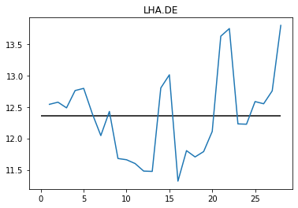
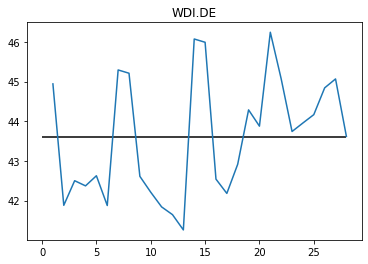

```python
import yfinance as yf
import pandas as pd
import numpy as np
from pandas_datareader import data as web
```

# Wertpapiersparplan
Mit einem Wertpapiersparplan können regelmäßig kleine Geldbeträge in Wertpapiere investiert werden. Der Wertpapiersparplan ist ein Werkzeug eines schrittweisen Vermögensaufbau.

Aufgrund regelmäßigen Aktienkäufe greift der sogenannte Cost-Average-Effekt. Dadurch werden Aktien langfristig zu einem Durchschnittspreis erworben.    

## Cost-Average (Daily)
Der Cost-Average-Effekt wird mithilfe des Kurses der Microsoft-Aktie der vergangenen 3 Jahre verdeutlicht:


```python
#start and end time of the figures dataset
start = pd.Timestamp("2017-01-01")
end = pd.Timestamp("2020-01-01")
#get ticker information with Yahoo-Finance API
msft = yf.Ticker('msft').history(start = start, end = end , auto_adjust = True)
#calculate cumulative average
msft = msft.assign(Mean =  msft['Close'].cumsum() / pd.Series(np.arange(1, len(msft)+1), msft.index))
#plot close-costs and average-costs over time
msft[['Mean', 'Close']].plot();
```

Wurde zwischen den Jahren 2017 und 2020 täglich die Microsoft-Aktie bespart, beträgt der durchschnittliche Einkaufspreis der Aktie etwa 78€. Bei einem schnellen Anstieg des Aktienwerts steigt der durchschnittliche Einkaufspreis nur langsam. 


```python
msft['Close'].mean()
```


    98.88801061007969


Am Beispiel der Aktie der Deutschen Telekom wird der Average-Cost-Effekt bei schwankenden Kursen verdeutlicht.


```python
dtag = web.DataReader(name="DTE.DE", data_source='yahoo', start=start, end=end)
dtag = dtag.assign(Mean =  dtag['Close'].cumsum() / pd.Series(np.arange(1, len(dtag)+1), dtag.index))
```


```python
dtag[['Mean','Close']].plot()
```


    <matplotlib.axes._subplots.AxesSubplot at 0x223dc376bc8>


```python
dtag['Close'].mean()
```


    14.99538917843459


## Average Cost (monthly)

In der Praxis ist ein Wertpapiersparplan mit regelmäßiger Ausführung im Abstand eines Monats möglich.
Die Comdirect bietet die Ausführung jeweils am 1., 7., 15., oder 21. Tag des Monats an.
Nachfolgend wird untersucht, welcher Tag des Monats historisch den niedrigsten Durchschnittspreis erzielte. Da viele ihr Gehalt zum Monatsende beziehen, bietet sich die Ausführung am 1. an. Folgt jeder diesem Ansatz, ist die Nachfrage aufgrund der Sparplanausführung am 1. entsprechend erhöht. Auf der anderen Seite sind, vorausgesetzt eine Aktie steigt auf lange Sicht, die Kosten geringer, je früher die Aktie bezogen wird. 


```python
check_for = [1,2,3,4,5,6,7,8,9,10,11,12,13,14,15,16,17,18,19,20,21,22,23,24,25,26,27,28]
```


```python
def get_time_vector(df, dom = 1, start = '2015-01-01', end = '2020-01-01'):
    import sys
    time_vector = []
    start = pd.Timestamp(start)
    end = pd.Timestamp(end)
    while(start.day < dom):
        start += pd.Timedelta('1 days')
    months = (end.year - start.year) * 12 + (end.month - start.month)
    for i in range(1,months):
        c = 0
        month = ""
        while np.datetime64(start) not in df.index.values:
            month = start.month
            start += pd.Timedelta('1 days')
            c += 1
        time_vector.append(np.datetime64(start))
        if start.month == month:
            start = start.replace(day=start.day - c)
            if(start.month==12):
                start = start.replace(year = start.year + 1).replace(month = 1)
            else:
                start = start.replace(month=start.month + 1)
    return time_vector
```

Hier am Beispiel der Microsoft-Aktie


```python
for i in check_for:
    temp = get_time_vector(msft, dom = i, start = start, end = end)
    temp = msft.loc[temp]
    mean = temp['Close'].mean()
    print("Durchschnitt ", i,".: " ,mean, sep='')  
```

    Durchschnitt 1.: 60.052857142857114
    Durchschnitt 2.: 59.67400000000003
    Durchschnitt 3.: 59.13000000000006
    Durchschnitt 4.: 58.86999999999994
    Durchschnitt 5.: 58.86999999999994
    Durchschnitt 6.: 59.38000000000006
    Durchschnitt 7.: 59.91857142857147
    Durchschnitt 8.: 59.83114285714282
    Durchschnitt 9.: 59.19000000000004
    Durchschnitt 10.: 59.17000000000002
    Durchschnitt 11.: 59.71000000000002
    Durchschnitt 12.: 59.160000000000025
    Durchschnitt 13.: 59.25
    Durchschnitt 14.: 61.31457142857149
    Durchschnitt 15.: 61.28542857142854
    Durchschnitt 16.: 61.275714285714265
    Durchschnitt 17.: 59.089999999999975
    Durchschnitt 18.: 59.05999999999996
    Durchschnitt 19.: 58.86999999999994
    Durchschnitt 20.: 59.27999999999998
    Durchschnitt 21.: 61.25799999999997
    Durchschnitt 22.: 61.1317142857143
    Durchschnitt 23.: 59.49
    Durchschnitt 24.: 60.019999999999996
    Durchschnitt 25.: 60.17000000000002
    Durchschnitt 26.: 60.730000000000004
    Durchschnitt 27.: 62.16000000000001
    Durchschnitt 28.: 60.840571428571415
    


```python
for i in check_for:
    temp = get_time_vector(dtag, dom = i, start = start, end = end)
    temp = dtag.loc[temp]
    mean = temp['Close'].mean()
    print("Durchschnitt ", i,".: " ,mean, sep='')  
    
```

    Durchschnitt 1.: 16.03642817905971
    Durchschnitt 2.: 16.424999237060547
    Durchschnitt 3.: 16.364999771118164
    Durchschnitt 4.: 16.559999465942383
    Durchschnitt 5.: 16.610000610351562
    Durchschnitt 6.: 16.549999237060547
    Durchschnitt 7.: 15.719714082990373
    Durchschnitt 8.: 15.782857458932058
    Durchschnitt 9.: 16.389999389648438
    Durchschnitt 10.: 16.2450008392334
    Durchschnitt 11.: 16.364999771118164
    Durchschnitt 12.: 16.235000610351562
    Durchschnitt 13.: 16.354999542236328
    Durchschnitt 14.: 15.808142907278878
    Durchschnitt 15.: 15.900428880964007
    Durchschnitt 16.: 16.2549991607666
    Durchschnitt 17.: 16.25
    Durchschnitt 18.: 16.280000686645508
    Durchschnitt 19.: 16.219999313354492
    Durchschnitt 20.: 16.424999237060547
    Durchschnitt 21.: 16.295714351109098
    Durchschnitt 22.: 16.480286298479353
    Durchschnitt 23.: 16.31999969482422
    Durchschnitt 24.: 16.190000534057617
    Durchschnitt 25.: 16.325000762939453
    Durchschnitt 26.: 16.459999084472656
    Durchschnitt 27.: 16.350000381469727
    Durchschnitt 28.: 16.30871374947684
    

## Vergleich DAX30


```python
dax30 = ["FME.DE","VNA.DE","DTE.DE","HEN3.DE","BEI.DE",
         "1COV.DE","ALV.DE","SAP.DE","DB1.DE","MRK.DE",
         "EOAN.DE","DPW.DE","BAYN.DE","BAS.DE","SIE.DE",
         "RWE.DE","MUV2.DE","HEI.DE","IFX.DE","LIN.DE",
         "ADS.DE","FRE.DE","BMW.DE","CON.DE","LHA.DE",
         "VOW3.DE","DBK.DE","WDI.DE","DAI.DE","TKA.DE"]
```


```python
df = pd.DataFrame(index=check_for, columns=dax30)
start="2017-01-01"
end="2020-01-01"
for stock in dax30:
    name = stock
    stock = web.DataReader(name=stock, data_source='yahoo', start=start, end=end)
    for i in check_for:
        temp = get_time_vector(stock, dom = i, start = start, end = end)
        temp = stock.loc[temp]
        mean = temp['Close'].mean()
        df[name].loc[i] = mean

```


```python
#df = df.append(pd.Series(name='avg'))
#for i in dax30:
#    df[i].loc["avg"] = df[i].mean()
df
```


<div>
<table border="1" class="dataframe">
  <thead>
    <tr style="text-align: right;">
      <th></th>
      <th>FME.DE</th>
      <th>VNA.DE</th>
      <th>DTE.DE</th>
      <th>HEN3.DE</th>
      <th>BEI.DE</th>
      <th>1COV.DE</th>
      <th>ALV.DE</th>
      <th>SAP.DE</th>
      <th>DB1.DE</th>
      <th>MRK.DE</th>
      <th>...</th>
      <th>ADS.DE</th>
      <th>FRE.DE</th>
      <th>BMW.DE</th>
      <th>CON.DE</th>
      <th>LHA.DE</th>
      <th>VOW3.DE</th>
      <th>DBK.DE</th>
      <th>WDI.DE</th>
      <th>DAI.DE</th>
      <th>TKA.DE</th>
    </tr>
  </thead>
  <tbody>
    <tr>
      <td>1</td>
      <td>76.5171</td>
      <td>30.772</td>
      <td>16.0364</td>
      <td>111.597</td>
      <td>81.5883</td>
      <td>69.3906</td>
      <td>157.883</td>
      <td>84.084</td>
      <td>83.0223</td>
      <td>102.124</td>
      <td>...</td>
      <td>147.414</td>
      <td>73.6237</td>
      <td>84.7731</td>
      <td>184.377</td>
      <td>12.541</td>
      <td>145.473</td>
      <td>17.0766</td>
      <td>44.94</td>
      <td>70.0531</td>
      <td>23.6059</td>
    </tr>
    <tr>
      <td>2</td>
      <td>82.2</td>
      <td>31.35</td>
      <td>16.425</td>
      <td>114.9</td>
      <td>81.87</td>
      <td>64.99</td>
      <td>157.3</td>
      <td>83.54</td>
      <td>76.98</td>
      <td>101.25</td>
      <td>...</td>
      <td>151.3</td>
      <td>74.77</td>
      <td>89.98</td>
      <td>187</td>
      <td>12.575</td>
      <td>137.75</td>
      <td>15.659</td>
      <td>41.88</td>
      <td>71.18</td>
      <td>22.955</td>
    </tr>
    <tr>
      <td>3</td>
      <td>81.26</td>
      <td>30.8</td>
      <td>16.365</td>
      <td>113.15</td>
      <td>81.11</td>
      <td>64.94</td>
      <td>159.55</td>
      <td>82.89</td>
      <td>77.61</td>
      <td>101.45</td>
      <td>...</td>
      <td>149.25</td>
      <td>73.88</td>
      <td>90.83</td>
      <td>189</td>
      <td>12.485</td>
      <td>140.45</td>
      <td>15.8108</td>
      <td>42.5</td>
      <td>72.1</td>
      <td>23.02</td>
    </tr>
    <tr>
      <td>4</td>
      <td>80.87</td>
      <td>30.8</td>
      <td>16.56</td>
      <td>113.25</td>
      <td>80.48</td>
      <td>62.15</td>
      <td>160.4</td>
      <td>82.43</td>
      <td>77.1</td>
      <td>101.45</td>
      <td>...</td>
      <td>146.4</td>
      <td>74.57</td>
      <td>90.18</td>
      <td>187.15</td>
      <td>12.76</td>
      <td>138.75</td>
      <td>16.2972</td>
      <td>42.37</td>
      <td>72.07</td>
      <td>22.665</td>
    </tr>
    <tr>
      <td>5</td>
      <td>80.54</td>
      <td>31.405</td>
      <td>16.61</td>
      <td>113.55</td>
      <td>80.8</td>
      <td>62.76</td>
      <td>160.7</td>
      <td>82.69</td>
      <td>76.39</td>
      <td>103</td>
      <td>...</td>
      <td>144.3</td>
      <td>74.56</td>
      <td>90.34</td>
      <td>186.25</td>
      <td>12.795</td>
      <td>139.1</td>
      <td>16.1678</td>
      <td>42.625</td>
      <td>72.05</td>
      <td>22.75</td>
    </tr>
    <tr>
      <td>6</td>
      <td>80.6</td>
      <td>31.25</td>
      <td>16.55</td>
      <td>113.1</td>
      <td>80.54</td>
      <td>62.4</td>
      <td>161.1</td>
      <td>83.66</td>
      <td>75.44</td>
      <td>102.15</td>
      <td>...</td>
      <td>144.8</td>
      <td>74.88</td>
      <td>90.51</td>
      <td>188.3</td>
      <td>12.395</td>
      <td>139</td>
      <td>16.3507</td>
      <td>41.875</td>
      <td>72.04</td>
      <td>22.625</td>
    </tr>
    <tr>
      <td>7</td>
      <td>75.9163</td>
      <td>31.3456</td>
      <td>15.7197</td>
      <td>112.694</td>
      <td>83.1694</td>
      <td>69.8706</td>
      <td>156.366</td>
      <td>85.3697</td>
      <td>80.6811</td>
      <td>102.349</td>
      <td>...</td>
      <td>144.306</td>
      <td>73.0906</td>
      <td>82.9814</td>
      <td>188.891</td>
      <td>12.0443</td>
      <td>141.964</td>
      <td>16.3364</td>
      <td>45.2911</td>
      <td>66.9091</td>
      <td>23.4323</td>
    </tr>
    <tr>
      <td>8</td>
      <td>76.4311</td>
      <td>32.1664</td>
      <td>15.7829</td>
      <td>115.171</td>
      <td>84.3157</td>
      <td>68.9574</td>
      <td>155.394</td>
      <td>85.9234</td>
      <td>80.3314</td>
      <td>100.794</td>
      <td>...</td>
      <td>144.014</td>
      <td>73.4306</td>
      <td>83.6711</td>
      <td>187.629</td>
      <td>12.428</td>
      <td>140.07</td>
      <td>16.0113</td>
      <td>45.2086</td>
      <td>66.812</td>
      <td>23.2331</td>
    </tr>
    <tr>
      <td>9</td>
      <td>75.11</td>
      <td>31.025</td>
      <td>16.39</td>
      <td>114.2</td>
      <td>80.77</td>
      <td>62.07</td>
      <td>160.3</td>
      <td>84.34</td>
      <td>76.64</td>
      <td>102.3</td>
      <td>...</td>
      <td>144.5</td>
      <td>72.43</td>
      <td>89.83</td>
      <td>186.9</td>
      <td>11.68</td>
      <td>145.85</td>
      <td>16.1544</td>
      <td>42.61</td>
      <td>71.98</td>
      <td>22.49</td>
    </tr>
    <tr>
      <td>10</td>
      <td>76.95</td>
      <td>31.475</td>
      <td>16.245</td>
      <td>114.2</td>
      <td>80.99</td>
      <td>64.09</td>
      <td>160.05</td>
      <td>84</td>
      <td>76.23</td>
      <td>101.95</td>
      <td>...</td>
      <td>144.8</td>
      <td>73.12</td>
      <td>89.91</td>
      <td>191.9</td>
      <td>11.66</td>
      <td>146.05</td>
      <td>15.7617</td>
      <td>42.21</td>
      <td>72.23</td>
      <td>22.925</td>
    </tr>
    <tr>
      <td>11</td>
      <td>76.1</td>
      <td>31.4</td>
      <td>16.365</td>
      <td>113.9</td>
      <td>80.28</td>
      <td>63.82</td>
      <td>160.2</td>
      <td>83.95</td>
      <td>76.46</td>
      <td>102.95</td>
      <td>...</td>
      <td>145.55</td>
      <td>73.14</td>
      <td>90.13</td>
      <td>194.4</td>
      <td>11.6</td>
      <td>151</td>
      <td>16.1276</td>
      <td>41.84</td>
      <td>72.83</td>
      <td>23.685</td>
    </tr>
    <tr>
      <td>12</td>
      <td>75.41</td>
      <td>31.16</td>
      <td>16.235</td>
      <td>114.05</td>
      <td>80.35</td>
      <td>63.45</td>
      <td>159.2</td>
      <td>83.58</td>
      <td>75.96</td>
      <td>101.35</td>
      <td>...</td>
      <td>146</td>
      <td>72.63</td>
      <td>87.46</td>
      <td>189.35</td>
      <td>11.48</td>
      <td>147.3</td>
      <td>15.5698</td>
      <td>41.645</td>
      <td>70.79</td>
      <td>23.485</td>
    </tr>
    <tr>
      <td>13</td>
      <td>76.32</td>
      <td>30.95</td>
      <td>16.355</td>
      <td>114</td>
      <td>80.44</td>
      <td>63.38</td>
      <td>160.8</td>
      <td>84.18</td>
      <td>76.52</td>
      <td>103.6</td>
      <td>...</td>
      <td>147.95</td>
      <td>73.33</td>
      <td>87.81</td>
      <td>189</td>
      <td>11.475</td>
      <td>149.55</td>
      <td>16.1945</td>
      <td>41.26</td>
      <td>71.33</td>
      <td>23.83</td>
    </tr>
    <tr>
      <td>14</td>
      <td>76.538</td>
      <td>32.4674</td>
      <td>15.8081</td>
      <td>116.106</td>
      <td>83.5486</td>
      <td>71.9043</td>
      <td>159.167</td>
      <td>87.198</td>
      <td>80.9729</td>
      <td>100.299</td>
      <td>...</td>
      <td>150.729</td>
      <td>74.8563</td>
      <td>86.3066</td>
      <td>192.444</td>
      <td>12.8014</td>
      <td>146.834</td>
      <td>16.419</td>
      <td>46.0711</td>
      <td>68.1711</td>
      <td>23.3671</td>
    </tr>
    <tr>
      <td>15</td>
      <td>76.7906</td>
      <td>32.8123</td>
      <td>15.9004</td>
      <td>116.64</td>
      <td>83.8983</td>
      <td>71.8363</td>
      <td>158.779</td>
      <td>87.0717</td>
      <td>81.4391</td>
      <td>100.299</td>
      <td>...</td>
      <td>149.514</td>
      <td>74.9534</td>
      <td>86.19</td>
      <td>190.841</td>
      <td>13.0103</td>
      <td>145.863</td>
      <td>16.8221</td>
      <td>45.9886</td>
      <td>68.1226</td>
      <td>23.474</td>
    </tr>
    <tr>
      <td>16</td>
      <td>76.47</td>
      <td>31.19</td>
      <td>16.255</td>
      <td>114.6</td>
      <td>81.12</td>
      <td>63.89</td>
      <td>159.75</td>
      <td>83.73</td>
      <td>75.97</td>
      <td>101.95</td>
      <td>...</td>
      <td>148.3</td>
      <td>74.05</td>
      <td>86.53</td>
      <td>188.85</td>
      <td>11.32</td>
      <td>146.3</td>
      <td>15.7037</td>
      <td>42.54</td>
      <td>70.25</td>
      <td>23.95</td>
    </tr>
    <tr>
      <td>17</td>
      <td>76.04</td>
      <td>30.9</td>
      <td>16.25</td>
      <td>114.55</td>
      <td>81.29</td>
      <td>65.16</td>
      <td>159.4</td>
      <td>83.47</td>
      <td>75.71</td>
      <td>102.2</td>
      <td>...</td>
      <td>147.35</td>
      <td>73.82</td>
      <td>86.47</td>
      <td>188.8</td>
      <td>11.805</td>
      <td>146.35</td>
      <td>15.5966</td>
      <td>42.18</td>
      <td>70.35</td>
      <td>23.9</td>
    </tr>
    <tr>
      <td>18</td>
      <td>76.23</td>
      <td>30.995</td>
      <td>16.28</td>
      <td>114.5</td>
      <td>81.4</td>
      <td>66.78</td>
      <td>159.75</td>
      <td>83.6</td>
      <td>76.37</td>
      <td>103.3</td>
      <td>...</td>
      <td>151.7</td>
      <td>74.42</td>
      <td>87</td>
      <td>188.3</td>
      <td>11.705</td>
      <td>146.4</td>
      <td>15.6724</td>
      <td>42.915</td>
      <td>70.67</td>
      <td>24.005</td>
    </tr>
    <tr>
      <td>19</td>
      <td>75.82</td>
      <td>30.45</td>
      <td>16.22</td>
      <td>113.45</td>
      <td>81.71</td>
      <td>66.63</td>
      <td>159.55</td>
      <td>83.99</td>
      <td>76.16</td>
      <td>102.8</td>
      <td>...</td>
      <td>152.3</td>
      <td>73.87</td>
      <td>86.59</td>
      <td>188.85</td>
      <td>11.79</td>
      <td>147.8</td>
      <td>15.8018</td>
      <td>44.285</td>
      <td>70.68</td>
      <td>23.615</td>
    </tr>
    <tr>
      <td>20</td>
      <td>75.72</td>
      <td>30.38</td>
      <td>16.425</td>
      <td>113</td>
      <td>81.9</td>
      <td>68.65</td>
      <td>159.25</td>
      <td>83.8</td>
      <td>76.01</td>
      <td>102.7</td>
      <td>...</td>
      <td>152.2</td>
      <td>74.24</td>
      <td>87.15</td>
      <td>186.2</td>
      <td>12.11</td>
      <td>148.2</td>
      <td>16.1187</td>
      <td>43.875</td>
      <td>70.64</td>
      <td>24</td>
    </tr>
    <tr>
      <td>21</td>
      <td>77.5457</td>
      <td>32.8767</td>
      <td>16.2957</td>
      <td>119.943</td>
      <td>84.9434</td>
      <td>69.4829</td>
      <td>165.221</td>
      <td>88.0186</td>
      <td>82.2254</td>
      <td>101.881</td>
      <td>...</td>
      <td>152.063</td>
      <td>75.7317</td>
      <td>86.5223</td>
      <td>193.21</td>
      <td>13.624</td>
      <td>144.397</td>
      <td>16.5687</td>
      <td>46.2414</td>
      <td>68.7614</td>
      <td>23.1857</td>
    </tr>
    <tr>
      <td>22</td>
      <td>79.0806</td>
      <td>33.2264</td>
      <td>16.4803</td>
      <td>120.963</td>
      <td>86.7406</td>
      <td>70.4931</td>
      <td>166.193</td>
      <td>88.7957</td>
      <td>81.8757</td>
      <td>102.95</td>
      <td>...</td>
      <td>153.131</td>
      <td>76.8877</td>
      <td>86.7943</td>
      <td>193.404</td>
      <td>13.7454</td>
      <td>141.677</td>
      <td>16.5991</td>
      <td>45.066</td>
      <td>69.4123</td>
      <td>24.2251</td>
    </tr>
    <tr>
      <td>23</td>
      <td>75.02</td>
      <td>30.385</td>
      <td>16.32</td>
      <td>112.9</td>
      <td>81.66</td>
      <td>67.2</td>
      <td>157.45</td>
      <td>82.87</td>
      <td>77.99</td>
      <td>101.25</td>
      <td>...</td>
      <td>152.5</td>
      <td>73.75</td>
      <td>86.26</td>
      <td>185.05</td>
      <td>12.23</td>
      <td>152.8</td>
      <td>15.9402</td>
      <td>43.74</td>
      <td>70.17</td>
      <td>23.72</td>
    </tr>
    <tr>
      <td>24</td>
      <td>74.69</td>
      <td>30.05</td>
      <td>16.19</td>
      <td>112.9</td>
      <td>81.68</td>
      <td>68.55</td>
      <td>157.3</td>
      <td>83.46</td>
      <td>79.12</td>
      <td>100.5</td>
      <td>...</td>
      <td>152.8</td>
      <td>73.19</td>
      <td>87.33</td>
      <td>185.8</td>
      <td>12.225</td>
      <td>153.6</td>
      <td>16.373</td>
      <td>43.955</td>
      <td>71.18</td>
      <td>23.95</td>
    </tr>
    <tr>
      <td>25</td>
      <td>74.88</td>
      <td>29.955</td>
      <td>16.325</td>
      <td>114.95</td>
      <td>82.07</td>
      <td>70.56</td>
      <td>162.5</td>
      <td>84.66</td>
      <td>80.65</td>
      <td>101.3</td>
      <td>...</td>
      <td>153.85</td>
      <td>73.72</td>
      <td>88.8</td>
      <td>187.85</td>
      <td>12.585</td>
      <td>153.9</td>
      <td>17.3146</td>
      <td>44.165</td>
      <td>72.35</td>
      <td>24.265</td>
    </tr>
    <tr>
      <td>26</td>
      <td>76.32</td>
      <td>29.985</td>
      <td>16.46</td>
      <td>114.55</td>
      <td>82.23</td>
      <td>70.05</td>
      <td>163</td>
      <td>85.02</td>
      <td>81.57</td>
      <td>102.8</td>
      <td>...</td>
      <td>155.4</td>
      <td>74.68</td>
      <td>88.13</td>
      <td>186.75</td>
      <td>12.55</td>
      <td>152.5</td>
      <td>17.3503</td>
      <td>44.84</td>
      <td>71.56</td>
      <td>23.95</td>
    </tr>
    <tr>
      <td>27</td>
      <td>76.39</td>
      <td>30.015</td>
      <td>16.35</td>
      <td>115.5</td>
      <td>83</td>
      <td>70.5</td>
      <td>162</td>
      <td>85.23</td>
      <td>80.85</td>
      <td>102.95</td>
      <td>...</td>
      <td>153.85</td>
      <td>74.7</td>
      <td>87.41</td>
      <td>184.75</td>
      <td>12.755</td>
      <td>149.9</td>
      <td>17.1183</td>
      <td>45.065</td>
      <td>70.72</td>
      <td>24.35</td>
    </tr>
    <tr>
      <td>28</td>
      <td>78.4629</td>
      <td>32.8091</td>
      <td>16.3087</td>
      <td>117.789</td>
      <td>86.0111</td>
      <td>71.022</td>
      <td>164.059</td>
      <td>87.8697</td>
      <td>80.2169</td>
      <td>103.139</td>
      <td>...</td>
      <td>158.174</td>
      <td>74.9897</td>
      <td>84.4249</td>
      <td>191.237</td>
      <td>13.7956</td>
      <td>139.866</td>
      <td>16.6009</td>
      <td>43.6161</td>
      <td>68.6917</td>
      <td>23.5914</td>
    </tr>
  </tbody>
</table>
<p>28 rows × 30 columns</p>
</div>


```python
%matplotlib inline 
for line in dax30:
    plt.plot(df[line])
    plt.hlines(df[line].mean(), 0, 28 )
    plt.title(line)
    plt.show()

```








```python

```
